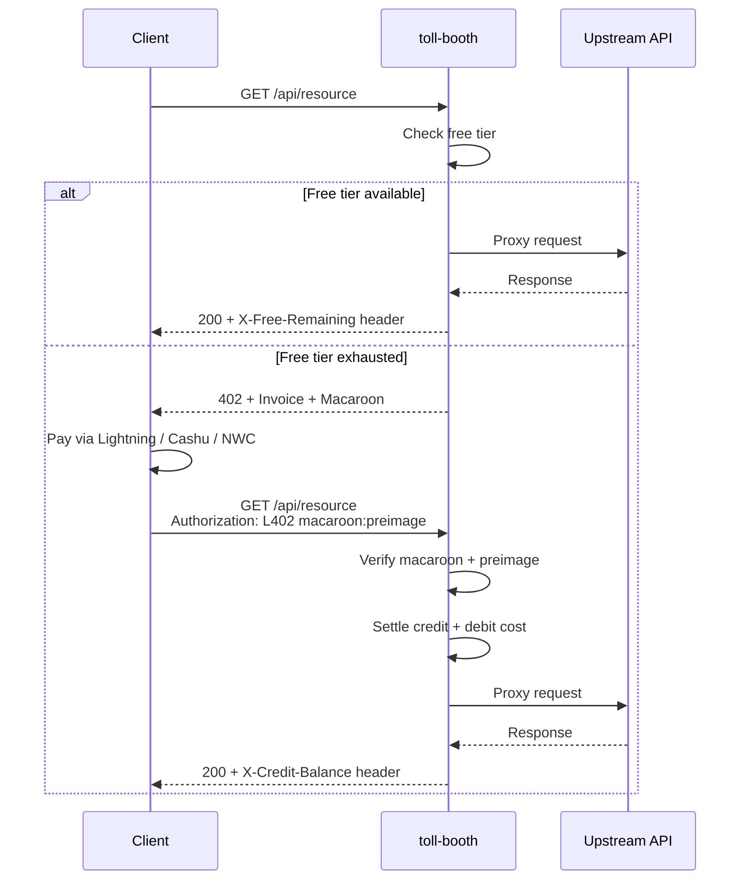

# Configuration

## Booth constructor options

The `Booth` constructor accepts a config object with `adapter` plus all `BoothConfig` fields:

### Core options

| Option | Type | Default | Description |
|--------|------|---------|-------------|
| `adapter` | `'express' \| 'web-standard'` | — | **Required.** Framework integration to use. For Hono, use `createHonoTollBooth()` directly instead. |
| `backend` | `LightningBackend` | — | Lightning node for invoice creation and status checks. Optional when using Cashu-only mode, x402, or xcashu. |
| `pricing` | `Record<string, number \| PriceInfo \| TieredPricing>` | — | **Required.** Route pattern to cost. Values can be a number (sats), a `PriceInfo` object (`{ sats: 10, usd: 1 }`), or a tiered map (`{ default: 10, premium: 100 }`). |
| `upstream` | `string` | — | **Required.** URL to proxy authorised requests to. |
| `rootKey` | `string` | Random | Macaroon signing key (64 hex chars / 32 bytes). Auto-generated if omitted; **set a persistent key for production** or all macaroons are invalidated on restart. |
| `defaultInvoiceAmount` | `number` | `1000` | Default invoice amount in sats. Used as the route cost when `strictPricing` challenges an unpriced route. |
| `strictPricing` | `boolean` | `false` | When true, unpriced routes are challenged (402) instead of passing through free. Prevents mount-prefix mismatches from silently bypassing billing. |

### Storage

| Option | Type | Default | Description |
|--------|------|---------|-------------|
| `dbPath` | `string` | `./toll-booth.db` | SQLite database file path. Mutually exclusive with `storage`. |
| `storage` | `StorageBackend` | SQLite | Custom storage backend. Mutually exclusive with `dbPath`. Use `memoryStorage()` for tests. |
| `invoiceMaxAgeMs` | `number` | `86400000` (24h) | Maximum age of stored invoices before automatic pruning. Set to `0` to disable. |

### Free tier

| Option | Type | Default | Description |
|--------|------|---------|-------------|
| `freeTier` | `{ requestsPerDay: number }` or `{ creditsPerDay: number }` | — | Daily free allowance per IP. Request-count mode: each request costs one unit. Credit-based mode: each request costs the route price in sats. IPs are one-way hashed with a daily-rotating salt. |

### Credit system

| Option | Type | Default | Description |
|--------|------|---------|-------------|
| `creditTiers` | `CreditTier[]` | — | Volume discount tiers. Each tier specifies `amountSats` (what the user pays), `creditSats` (what they receive), and a `label`. Used by the payment page tier selector and `/create-invoice`. |

### Payment rails

At least one payment method is required. Multiple rails can be active simultaneously; the 402 challenge includes headers for all active rails.

| Option | Type | Description |
|--------|------|-------------|
| `x402` | `X402RailConfig` | x402 stablecoin payments (USDC on Base, Polygon). Requires `receiverAddress`, `network`, and a `facilitator`. |
| `xcashu` | `XCashuConfig` | xcashu (NUT-24) direct-header Cashu payments. Requires `mints` (array of accepted mint URLs). Optional `unit` (default `'sat'`) and `onProofsReceived` callback. |
| `ietfPayment` | `IETFPaymentConfig` | IETF Payment authentication (draft-ryan-httpauth-payment-01). Requires `realm`. Optional `hmacSecret` (auto-derived from rootKey), `challengeExpirySecs` (default 900), `description`. Requires a Lightning backend. |
| `ietfSession` | `SessionConfig` | IETF Payment session intent for streaming payments. Requires `ietfPayment` and a Lightning backend with `sendPayment()`. Optional `maxSessionDurationMs`, `maxDepositSats`, `sessionPruneIntervalMs`. |
| `nwcPayInvoice` | `(nwcUri: string, bolt11: string) => Promise<string>` | NWC payment callback. Returns the payment preimage. Enables NWC option on the payment page. |
| `redeemCashu` | `(token: string, paymentHash: string) => Promise<number>` | Cashu redemption callback. Returns credited amount in sats. Must be idempotent for crash recovery. Enables Cashu option on the payment page. |

### Network and proxy

| Option | Type | Default | Description |
|--------|------|---------|-------------|
| `trustProxy` | `boolean` | `false` | Trust `X-Forwarded-For` / `X-Real-IP` headers for client IP. Enable only behind a trusted reverse proxy. |
| `getClientIp` | `(request: unknown) => string` | — | Custom IP resolver for runtimes where the IP isn't in headers (Deno, Bun, Workers). |
| `upstreamTimeout` | `number` | `30000` | Proxy timeout in milliseconds. |
| `responseHeaders` | `Record<string, string>` | — | Extra headers added to every response. |

### Geo-blocking

| Option | Type | Default | Description |
|--------|------|---------|-------------|
| `blockedCountries` | `readonly string[]` | — | ISO 3166-1 alpha-2 country codes to block (403 Forbidden). Use the exported `OFAC_SANCTIONED` constant for US sanctions compliance. |
| `countryHeader` | `string` | `'CF-IPCountry'` | HTTP header containing the country code, typically set by a CDN or reverse proxy. |

### Service metadata

| Option | Type | Default | Description |
|--------|------|---------|-------------|
| `serviceName` | `string` | `'toll-booth'` | Human-readable name used in invoice descriptions and 402 response bodies. |
| `description` | `string` | — | Service description included in 402 response bodies (only when `serviceName` is set). |

### Invoice rate limiting

| Option | Type | Description |
|--------|------|-------------|
| `invoiceRateLimit` | `{ maxPendingPerIp: number }` | Limits the number of pending (unpaid) invoices per client IP. Rate-limit `/create-invoice` at the reverse proxy level too. |

### Event hooks

Three optional callbacks for observing the payment lifecycle. Fire synchronously in the request path; keep them fast.

| Option | Type | Description |
|--------|------|-------------|
| `onPayment` | `(event: PaymentEvent) => void` | Fired once per payment hash on first successful authentication. Event: `{ timestamp, paymentHash, amountSats, currency, rail }`. |
| `onRequest` | `(event: RequestEvent) => void` | Fired on every authenticated or free-tier request. Event: `{ timestamp, endpoint, satsDeducted, remainingBalance, latencyMs, authenticated, currency, tier }`. |
| `onChallenge` | `(event: ChallengeEvent) => void` | Fired when a 402 payment challenge is issued. Event: `{ timestamp, endpoint, amountSats }`. |

## Subpath exports

Tree-shakeable imports for bundlers:

```typescript
// Core
import { Booth } from '@forgesworn/toll-booth'
import { createTollBooth } from '@forgesworn/toll-booth'

// Lightning backends
import { phoenixdBackend } from '@forgesworn/toll-booth/backends/phoenixd'
import { lndBackend } from '@forgesworn/toll-booth/backends/lnd'
import { clnBackend } from '@forgesworn/toll-booth/backends/cln'
import { lnbitsBackend } from '@forgesworn/toll-booth/backends/lnbits'
import { nwcBackend } from '@forgesworn/toll-booth/backends/nwc'

// Storage
import { sqliteStorage } from '@forgesworn/toll-booth/storage/sqlite'
import { memoryStorage } from '@forgesworn/toll-booth/storage/memory'

// Framework adapters
import { createExpressMiddleware } from '@forgesworn/toll-booth/adapters/express'
import { createWebStandardMiddleware } from '@forgesworn/toll-booth/adapters/web-standard'
import { createHonoTollBooth } from '@forgesworn/toll-booth/hono'

// Geo-blocking
import { OFAC_SANCTIONED } from '@forgesworn/toll-booth'
```

## Payment flow



1. Client requests a priced endpoint without credentials
2. Free tier checked — if allowance remains, request passes through
3. If exhausted → **402** response with BOLT-11 invoice + macaroon
4. Client pays via Lightning, NWC, or Cashu
5. Client sends `Authorization: L402 <macaroon>:<preimage>`
6. Macaroon verified, credit deducted, request proxied upstream
