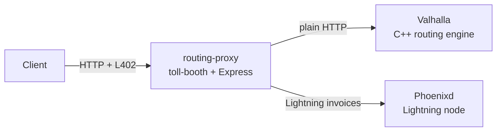

# valhalla-proxy

Production reference deployment for toll-booth. Gates the [Valhalla](https://github.com/valhalla/valhalla) routing engine (a C++ service) behind Lightning payments using Docker Compose.

This example demonstrates toll-booth as a **sidecar proxy** in front of non-JavaScript infrastructure; the upstream service has no knowledge of L402 or Lightning.

## Architecture



Three containers:

| Service | Image | Purpose |
|---------|-------|---------|
| `valhalla` | `ghcr.io/gis-ops/docker-valhalla/valhalla` | Open-source routing engine serving UK road data |
| `phoenixd` | `ghcr.io/acinq/phoenixd` | Lightweight Lightning node for invoice creation and payment verification |
| `routing-proxy` | Built from repo root | Express server running toll-booth middleware |

## Quick start

```bash
cd examples/valhalla-proxy
cp .env.example .env    # add your Phoenixd password and ROOT_KEY
docker compose up -d
```

Valhalla downloads and builds routing tiles on first launch; this takes several minutes depending on the region configured.

## Environment variables

| Variable | Default | Description |
|----------|---------|-------------|
| `PHOENIXD_URL` | `http://phoenixd:9740` | Phoenixd HTTP endpoint (internal Docker network) |
| `PHOENIXD_PASSWORD` | — | Phoenixd auth password (required) |
| `VALHALLA_URL` | `http://valhalla:8002` | Upstream Valhalla endpoint (internal Docker network) |
| `FREE_TIER_REQUESTS` | `10` | Daily free requests per IP |
| `DEFAULT_INVOICE_SATS` | `1000` | Default invoice amount |
| `TOLL_BOOTH_DB_PATH` | `/data/toll-booth.db` | SQLite database path (persisted via Docker volume) |
| `ROOT_KEY` | — | Macaroon signing key; 64 hex chars. **Required for production.** |
| `TRUST_PROXY` | `false` | Trust `X-Forwarded-For` / `X-Real-IP` headers |
| `PORT` | `3000` | HTTP listen port |

## Pricing

Configured in `server.ts`:

| Endpoint | Cost |
|----------|------|
| `/route` | 2 sats |
| `/isochrone` | 5 sats |
| `/sources_to_targets` | 10 sats |

All other endpoints return 402 (`strictPricing: true`).

## Credit tiers

| Tier | Pay | Receive | Discount |
|------|-----|---------|----------|
| Starter | 1,000 sats | 1,000 credits | — |
| Pro | 10,000 sats | 11,100 credits | 11% |
| Business | 100,000 sats | 125,000 credits | 25% |

## How it works

1. Client sends a routing request to the proxy
2. Free tier checked (10 requests/day per IP by default)
3. If exhausted, proxy returns HTTP 402 with a Lightning invoice
4. Client pays via any Lightning wallet
5. Client retries with `Authorization: L402 <macaroon>:<preimage>`
6. Proxy verifies payment, deducts credits, forwards request to Valhalla
7. Valhalla response is returned to the client with `X-Credit-Balance` header

## Docker build

The Dockerfile uses a multi-stage build:

1. **Stage 1** builds toll-booth from the repo root source and packs it as a tarball
2. **Stage 2** installs the tarball as a dependency and copies `server.ts`

This means the example always uses the latest local toll-booth source, not the published npm package.

## Customisation

To gate a different upstream service, change:

- `VALHALLA_URL` to point at your service
- The `pricing` object in `server.ts` to match your API's routes
- The `docker-compose.yml` to replace the Valhalla service with yours

The proxy itself is framework-agnostic at the upstream level; any HTTP service works regardless of language or framework.
